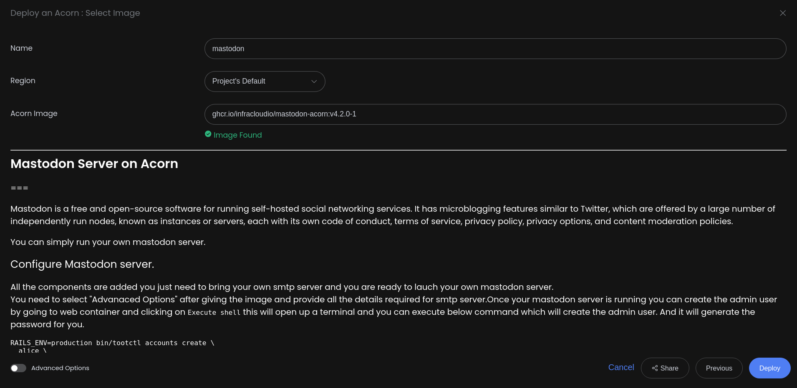
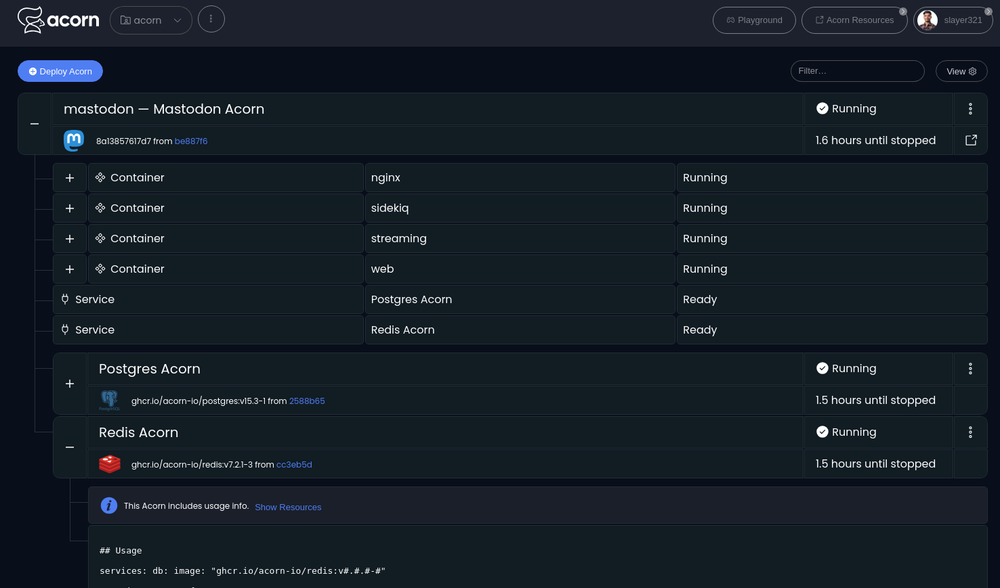
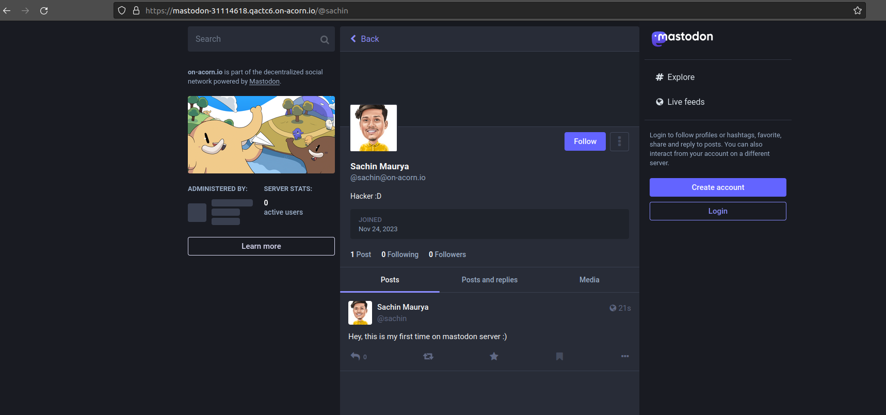
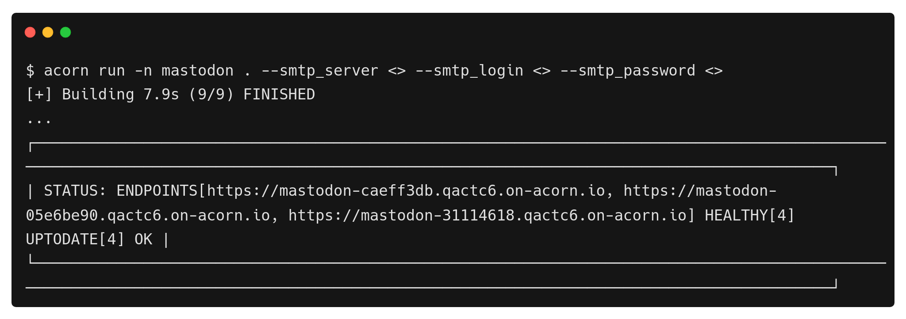

# Deploying Mastodon on Acorn

Have you heard about [Mastodon](https://joinmastodon.org/) , the decentralized social network? It's a bit like Twitter, but with a twist. Instead of one big platform, Mastodon is a network of independent servers, each with its own community, all connected through a shared system called the "fediverse". These large number of nodes run independently which are known as instances, each with its own code of conduct, terms of service, privacy policy, privacy options, and content moderation policies.

It is a free and open-source software for running self-hosted social networking services. If you're thinking about hosting your own Mastodon server, that's a cool idea! You can create your own online space where people can join and chat dedicated to specific topic or common interest. But here's the catch: hosting your Mastodon server comes with some challenges, managing infratructure complexity and so on.

This is where [Acorn](http://www.acorn.io) comes in, it is a user-friendly cloud platform, simplifies deploying modern cloud-native apps with a free sandbox accessible through GitHub account. It streamlines development workflows using mainstream container tools, providing the power of Kubernetes and Terraform without complexity.

Deploying on Acorn is simple as defining your application with an [Acornfile](https://docs.acorn.io/reference/acornfile), generating a deployable Acorn Image. In this tutorial, we'll see how to set up your Mastodon server.

If you wish to proceed directly to the end, simply click the button below and enter the SMTP details to launch the app immediately in a free sandbox environment. All you need to join is a GitHub ID for account creation.

[](https://acorn.io/run/ghcr.io/infracloudio/mastodon-acorn:v4.%23.%23-%23?ref=sudhanshu456&name=tech-mastodon)

> _Note: Everything shown in this tutorial can be found in [this repository](https://github.com/infracloudio/mastodon-acorn)_.

## Pre-requisites

- Acorn CLI: The CLI allows you to interact with the Acorn Runtime as well as Acorn to deploy and manage your applications. Refer to the [Installation documentation](https://docs.acorn.io/installation/installing) to install Acorn CLI for your environment.
- A GitHub account is required to sign up and use the Acorn Platform.

## Acorn Login

Log in to the [Acorn Platform](http://acorn.io) using the GitHub Sign-In option with your GitHub user.


After the installation of Acorn CLI for your OS, you can login to the Acorn platform.

```sh
$ acorn login
```

## Deploying the Mastodon server

There are two ways to deploy Mastodon server on Acorn Platform.

1. Using Acorn platform dashboard.
2. Using CLI

The Acorn Dashboard way is the easiest one where, in just a few clicks you can deploy the Mastodon on the platform and start using it. However, if you want to customize the application use the CLI option.

## Deploying Using Acorn Dashboard

In this option you use the published Acorn application image to deploy the Mastodon server in just a few clicks. It allows you to deploy your applications faster without any additional configurations. Let us see below how you can deploy Mastodon server to the Acorn platform dashboard.

1. Login to the [Acorn Platform](https://acorn.io/auth/login) using the Github Sign-In option with your Github user.
2. Select the "Deploy Acorn" option.
3. Choose the source for deploying your Acorns
   3.1. Select “From Acorn Image” to deploy the sample Application.

   

   3.2. Provide a name "tech-mastodon”, use the default Region and provide the URL for the Acorn image and you need to select "Advanced Options" and provide all the details required for SMTP server.

   ```sh
   ghcr.io/infracloudio/mastodon-acorn:v4.#.#-#
   ```

   

> _Note: The App will be deployed in the Acorn Sandbox Environment. As the App is provisioned on AcornPlatform in the sandbox environment it will only be available for 2 hrs and after that it will be shutdown. Upgrade to a pro account to keep it running longer_.

4. Once the Acorn is running, you can access it by clicking the `Endpoint` or the redirect link.

   4.1. Running Application on Acorn

   

   4.2. Running Mastodon

   

## Deploying Using Acorn CLI

As mentioned previously, running the Acorn application using CLI lets you understand the Acornfile. With the CLI option, you can customize the Mastodon app to your requirement or use your Acorn knowledge to run your own Mastodon Server.

To run the application using CLI you first need to clone the source code repository on your machine.

```sh
$ git clone https://github.com/infracloudio/mastodon-acorn.git
```

Once cloned here’s how the directory structure will look.

```sh

├── Acornfile
├── conf
│   └── nginx
│       └── mastodon.template
├── LICENSE
├── mastodon.svg
├── README.md
└── tutorial.md
```

### Understanding the Acornfile

To run the application we need an Acornfile which describes the whole application without all of the boilerplate of Kubernetes YAML files. The Acorn CLI is used to build, deploy, and operate Acorn on the Acorn cloud platform. It also can work on any Kubernetes cluster running the open source Acorn Runtime.

Below is the Acornfile for deploying the Mastodon Server that we created earlier:

```sh
services: postgres: {
	image: "ghcr.io/acorn-io/postgres:v#.#-#"
}

services: redis: image: "ghcr.io/acorn-io/redis:v#.#.#-#"


args: {
    smtp_port: "587"
    smtp_server: ""
    ...
    smtp_from_address: "AcornSocial <notification@on-acorn.io>"
}

containers:  {
    web: {
        image: "ghcr.io/mastodon/mastodon:v4.2.0"
        cmd: ["bash", "-c", "mkdir /mastodon/public/system; bundle exec rake db:setup; rm -f /mastodon/tmp/pids/server.pid; bundle exec rails s -p 3000"]
        ports: publish:"3000:3000/http"
        consumes: ["postgres", "redis"]
        env:{
            LOCAL_DOMAIN: "on-acorn.io"
            WEB_DOMAIN: "@{services.nginx.endpoint}"
            ...
        }
    }
    streaming:{
        image: "ghcr.io/mastodon/mastodon:v4.2.0"
        cmd: ["node","./streaming"]
        consumes: ["postgres", "redis"]
        ports: publish:"4000:4000/http"
        env:{
            LOCAL_DOMAIN: "on-acorn.io"
            WEB_DOMAIN: "@{services.nginx.endpoint}"
            ...
      }
    }
    sidekiq:{
        image: "ghcr.io/mastodon/mastodon:v4.2.0"
        cmd: ["bash", "-c", "bundle exec sidekiq"]
        consumes: ["postgres", "redis"]
        env:{
            LOCAL_DOMAIN: "on-acorn.io"
            WEB_DOMAIN: "@{services.nginx.endpoint}"
            ...
      }
    }
    nginx: {
        image: "nginx"
        ports: publish: "8000:80/http"
        dirs: {
        "/etc/nginx/conf.d": "./conf/nginx"
        }
        env:{
            NGINX_ENDPOINT: "@{services.nginx.endpoint}"
            STREAMING_ENDPOINT: "@{services.streaming.endpoint}"
            WEB_ENDPOINT: "@{services.web.endpoint}"
        }
        cmd: ["/bin/bash", "-c", "envsubst '$${NGINX_ENDPOINT},$${STREAMING_ENDPOINT},$${WEB_ENDPOINT}' < /etc/nginx/conf.d/mastodon.template > /etc/nginx/conf.d/default.conf && nginx -g 'daemon off;'"]
        dependsOn: ["web","streaming","sidekiq"]
    }

}
```

There are different components for running Mastodon server

- web
- sidekiq
- nginx
- db
- redis

The above Acornfile has the following elements:

- **Args**: Which is used to take the user args.
- **Services**: Here we're using the [Postgres](https://github.com/acorn-io/postgres) and [redis](https://github.com/acorn-io/redis) service that is built into Acorn as an [Acorn Service](https://docs.acorn.io/reference/services).
- **Containers**: We define different containers with following configurations:
  - **web**:
    - **image**: It defines Mastodon image
    - **ports**: port where our web application is listening on.
    - **env**: In the env section we are providing all the env variables which the application will be using.
    - **consumes**: Web consumes Postgres and Redis
    - **cmd**: Command used to run the web component
  - **streaming**:
    - **image**: Using Mastodon Image
    - **ports**: Port where our streaming application is listening on.
    - **env**: In the env section we are providing all the env variables which the application will be using.
    - **consumes**: Streaming consumes postgres and redis
    - **cmd**: Command use to run the streaming component
  - **sidekiq**:
    - **image**: This is where we define Mastodon image
    - **ports**: Port where our sidekiq application is listening on.
    - **env**: In the env section we are providing all the env variables which the application will be using.
    - **consumes**: sidekiq consumes postgres and redis
    - **cmd**: command use to run the streaming component
  - **nginx**:
    - **image**: Using Nginx image
    - **ports**: port where our nginx application is listening on.
    - **env**: In the env section we are providing all the env variables which the application will be using.
    - **dependsOn**: Nginx depends on all the above 3 components
    - **cmd**: Command used to run the streaming component

### Running the Application

Once you've logged using Acorn CLI you can directly deploy applications on the Acorn platform Sandbox plan. Run the following command from the root of the directory.

```sh
$ acorn run -n mastodon . --smtp_login <> --smtp_password <> --smtp_server <>
```

Below is what the output looks like.



## Mastodon Server

Inside the Aconfile all the components are already ready you just need to bring your own SMTP server and provide all the required details.

Once we provide all the details and our Mastodon Server is running below is what our Mastodon dashboard looks like once we logged in as a new user.


> _Note: To create the admin account use the `Execute shell` feature on acorn UI for Web component and run below command_

```sh
RAILS_ENV=production bin/tootctl accounts create \
  alice \
  --email jovon49621@glalen.com \
  --confirmed \
  --role Owner
```

## What's Next?

1. The Mastodon provisioned on Acorn Platform is available for two hours, you should upgrade to Pro account to keep it running for longer duration.
2. After deploying you can edit the Acorn Application or remove it if no longer needed. Click the `Edit` option to edit your Acorn's Image. Toggle the `Advanced Options` switch for additional edit options.
3. Remove the Acorn by selecting the `Remove` option from your Acorn dashboard.

## Conclusion

In this tutorial we learned how to use the Acornfile and run Mastodon Server. Also, different ways to deploy Mastodon server using CLI and Dashboard approach.

Now, you can send the URL to your friends and family to join the server.
