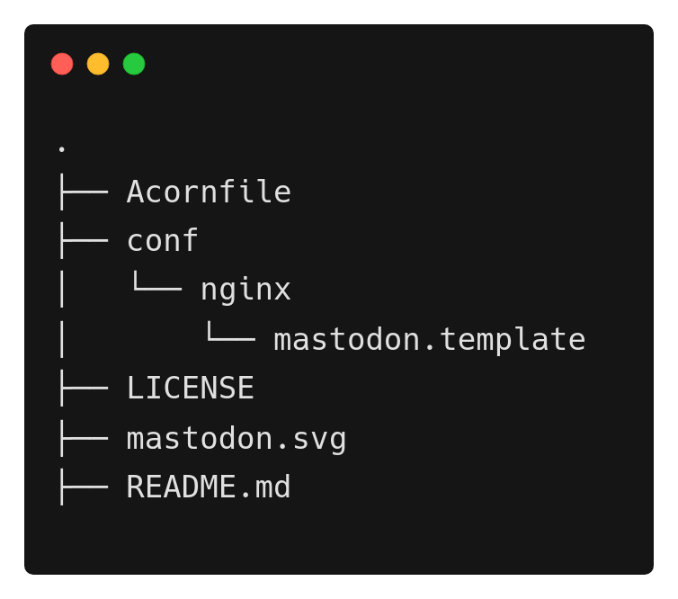

# Deploying Mastodon on Acorn

[Mastodon](https://joinmastodon.org/) is a free and open-source software for running self-hosted social networking services. It has microblogging features similar to Twitter, which are offered by a large number of independently run nodes, known as instances or servers, each with its own code of conduct, terms of service, privacy policy, privacy options, and content moderation policies.

[Acorn](http://www.acorn.io) is a cloud computing platform with a big free sandbox that anyone can use by registering with a GitHub account. It is designed to simplify running modern  cloud-native apps on the public cloud. You use familiar development and deployment workflows based on mainstream container tools without having to deal with provisioning or configuring any underlying cloud resources. Basically it provides all the power of Kubernetes and Terraform, without any of the complexity.

To deploy an application on Acorn we need to define our application as an Acornfile, which will produce the Acorn Image that we can deploy on the platform.  In this tutorial, we will explore how to provision Mastodon server on Acorn.

If you’re the kind of person who likes to skip to the end, you can [deploy the sample application in your sandbox now](https://acorn.io/run/ghcr.io/infracloudio/mastodon-acorn:v4.%23.%23-%23?ref=slayer321&name=mastodon)(Click on `Customize before deploying` and provide the SMTP details that is required) and just start poking around in it.  Sandbox deployments in Acorn are restricted by size, and run for two hours, so it should provide plenty of time for you to evaluate and test anything. You can start them over as often as you like, or you can upgrade to a paid Pro account if you want to run something in production. 

If you want to follow along, I’ll walk through the steps to deploy Mastodon Server using Acorn.

_Note: Everything shown in this tutorial can be found in [this repository](https://github.com/infracloudio/mastodon-acorn)_.

## Pre-requisites

- [Acorn CLI](https://docs.acorn.io/installation/installing)
- Github account to sign up for the Acorn Platform.

## Acorn Login
Login to the [Acorn Platform](http://beta.acorn.io) using the Github Sign-In option with your Github user.


After the installation of Acorn CLI for your OS, you can login to the Acorn platform.
```
$ acorn login beta.acorn.io
```

## Deploying the Mastodon server
In this post we will deploy Mastodon server.

In the Acorn platform, there are two ways you can try this sample application.
1. Using Acorn platform dashboard.
2. Using CLI

The First way is the easiest one where, in just a few clicks you can deploy the Mastodon on the platform and start using it. However, if you want to customize the application use the second option.

## Running the application using Dashboard

In this option you use the published Acorn application image to deploy the Mastodon server in just a few clicks. It allows you to deploy your applications faster without any additional configurations. Let us see below how you can deploy Mastodon server to the Acorn platform dashboard.

1. Login to the [Acorn Platform](https://acorn.io/auth/login)  using the Github Sign-In option with your Github user.
2. Select the “Create Acorn” option.
3. Choose the source for deploying your Acorns
   3.1. Select “From Acorn Image” to deploy the sample Application.


   3.2. Provide a name "tech-mastodon”, use the default Region and provide the URL for the Acorn image and you need to select "Advanaced Options" and provide all the details required for smtp server.
```
ghcr.io/infracloudio/mastodon-acorn:v4.#.#-#
```


_Note: The App will be deployed in the Acorn Sandbox Environment. As the App is provisioned on AcornPlatform in the sandbox environment it will only be available for 2 hrs and after that it will be shutdown. Upgrade to a pro account to keep it running longer_.

4. Once the Acorn is running, you can access it by clicking the Endpoint or the redirect link.
   4.1. Running Application on Acorn
   
   4.2. Running Mastodon
   


## Running the Application using acorn CLI
As mentioned previously, running the acorn application using CLI lets you understand the Acornfile. With the CLI option, you can customize the sample app to your requirement or use your Acorn knowledge to run your own Mastodon Server.

To run the application using CLI you first need to clone the source code repository on your machine.

```
$ git clone https://github.com/infracloudio/mastodon-acorn.git
```
Once cloned here’s how the directory structure will look.




### Understanding the Acornfile

We have the Mastodon server ready. Now to run the application we need an Acornfile which describes the whole application without all of the boilerplate of Kubernetes YAML files. The Acorn CLI is used to build, deploy, and operate Acorn on the Acorn cloud platform.  It also can work on any Kubernetes cluster running the open source Acorn Runtime. 

Below is the Acornfile for deploying the Mastodon Server that we created earlier:


There are different components for running Mastodon server
- web
- sidekiq
- nginx
- db
- redis

The above Acornfile has the following elements:

- **Args**: Which is used to take the user args.
- **Services**:  Here we're using the [Postgres](https://github.com/acorn-io/postgres) and [redis](https://github.com/acorn-io/redis) service that is built into Acorn as an [Acorn Service](https://docs.acorn.io/reference/services).
- **Containers**:  We define different containers with following configurations:
   - **web**: 
       - **image**: using mastodon image
       - **ports**:  port where our web application is listening on.
       - **env**:  In the env section we are providing all the env variables which the application will be using.
       - **consumes**: web consumes postgres and redis
       - **cmd**: command use to run the web component
   - **streaming**: 
       - **image**: using mastodon image
       - **ports**:  port where our streaming application is listening on.
       - **env**:  In the env section we are providing all the env variables which the application will be using.
       - **consumes**: streaming consumes postgres and redis
       - **cmd**: command use to run the streaming component
    - **sidekiq**: 
       - **image**: using mastodon image
       - **ports**:  port where our sidekiq application is listening on.
       - **env**:  In the env section we are providing all the env variables which the application will be using.
       - **consumes**: sidekiq consumes postgres and redis
       - **cmd**: command use to run the streaming component
    - **nginx**: 
       - **image**: using nginx image
       - **ports**:  port where our nginx application is listening on.
       - **env**:  In the env section we are providing all the env variables which the application will be using.
       - **dependsOn**: nginx depends on all the above 3 components
       - **cmd**: command use to run the streaming component

### Running the Application
We have already logged in using Acorn CLI now you can directly deploy applications on your sandbox on the Acorn platform. Run the following command from the root of the directory.

```
$ acorn run -n mastodon . --smtp_login <> --smtp_password <> --smtp_server <>
```

Below is what the output looks like.


## Mastodon Server

Inside the Aconfile all the components are already ready you just need to bring your own SMTP server and provide all the required details.

Once we provide all the details and our Mastodon Server is running below is what our Mastodon dashboard looks like once we logged in as a new user.


_Note: To create the admin account use the `Execute shell` feature on acorn UI for Web component and run below command_

```
RAILS_ENV=production bin/tootctl accounts create \
  alice \
  --email jovon49621@glalen.com \
  --confirmed \
  --role Owner
```

## What's Next?

1. The App is provisioned on Acorn Platform and is available for two hours. Upgrade to Pro account for anything you want to keep running longer.
2. After deploying you can edit the Acorn Application or remove it if no longer needed. Click the Edit option to edit your Acorn's Image. Toggle the Advanced Options switch for additional edit options.
3. Remove the Acorn by selecting the Remove option from your Acorn dashboard.


## Conclusion
In this tutorial we show how we can use the Acornfile and get our Mastodon Server up and running.
Now you can send the URL to your friends and family to join the server.